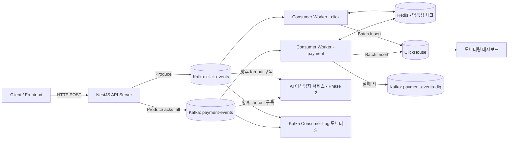
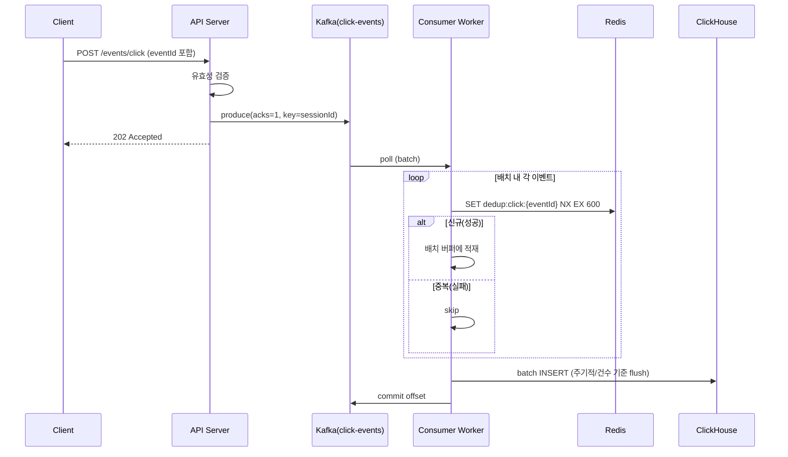
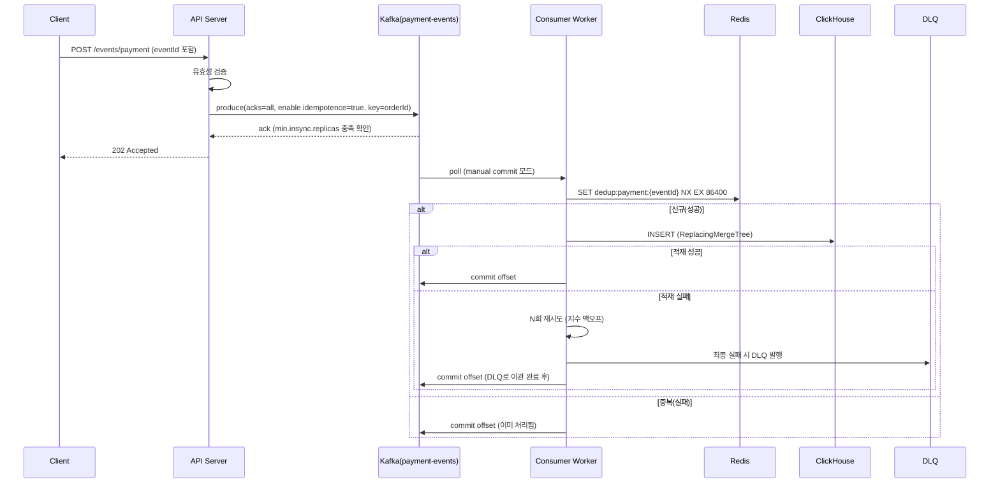

# LogPulse — 시스템 아키텍처 설계 문서

| 항목 | 내용 |
|---|---|
| 문서 버전 | v1.0 |
| 작성일 | 2026-09-02 |
| 관련 문서 | LogPulse_PRD.md |
| 문서 목적 | 실무 가동(Production-ready) 수준의 시스템 구성 설계 |

---

## 1. 아키텍처 개요

### 1.1 설계 원칙

1. **완충(Buffering) 우선**: 모든 이벤트는 API 서버가 직접 DB에 쓰지 않고, 반드시 Kafka를 거친다. API 서버의 책임은 "수신 + 검증 + 발행"으로 제한한다.
2. **신뢰성 차등화**: 토픽별로 유실 허용 수준이 다르므로 Producer/Consumer 설정, 파티션 전략, 장애 시 fail-open/fail-closed 정책을 명확히 분리한다.
3. **멱등성 이중 방어**: Redis(1차, 빠른 스킵)와 ClickHouse ReplacingMergeTree(2차, 최종 정리)로 중복 적재를 이중으로 방어한다.
4. **디커플링(Decoupling)**: 적재 파이프라인과 향후 AI 이상 탐지 파이프라인은 동일 이벤트를 "동시에, 독립적으로" 구독하는 구조로 설계하여 서로의 장애가 전파되지 않게 한다.
5. **관측 가능성(Observability) 내장**: 모든 컴포넌트는 처음부터 메트릭·로그를 남기도록 설계하며, 모니터링을 사후에 붙이는 대상이 아니라 설계의 일부로 취급한다.

### 1.2 전체 구조



### 1.3 컴포넌트 책임 요약

| 컴포넌트 | 책임 | 비책임 (하지 않는 일) |
|---|---|---|
| API Server (NestJS) | 요청 검증, Kafka 발행, 헬스체크 | DB 직접 쓰기, 멱등성 체크 |
| Kafka | 이벤트 완충, 순서 보장(파티션 내), 재처리 가능한 저장소 역할 | 데이터 가공/집계 |
| Consumer Worker | Redis 체크, 배치 변환, ClickHouse 적재, 실패 처리 | HTTP 요청 처리 |
| Redis | 이벤트 단위 멱등성 키 관리 | 영구 저장소 역할 |
| ClickHouse | 분석용 영구 저장, 집계 View 제공 | 트랜잭션성 CRUD |

---

## 2. 데이터 흐름 상세

### 2.1 click-events 흐름 (Best-effort, 고처리량 우선)



- click-events는 **acks=1** (리더 브로커 저장 확인 시점 응답)로 처리량을 우선한다.
- Redis 장애 시 **fail-open**: 멱등성 체크를 건너뛰고 그대로 적재한다(약간의 중복보다 가용성 우선). 단, 이 경우 로그 레벨 경고를 남긴다.
- Consumer 장애/지연 시에도 Kafka가 이벤트를 보관하므로 유실되지 않으며, "유실 허용"이라는 표현은 극단적 장애(브로커 다수 동시 다운 등) 상황에서의 정책적 허용을 의미한다.

### 2.2 payment-events 흐름 (Guaranteed Delivery, 무손실 우선)



- payment-events는 **acks=all + `enable.idempotence=true`**로 Producer 단계부터 무손실을 보장한다.
- Consumer는 **manual commit**을 사용하여, ClickHouse 적재(또는 DLQ 이관)가 완전히 끝난 뒤에만 오프셋을 커밋한다. 이렇게 하면 Consumer가 중간에 죽어도 미처리 메시지가 재처리된다.
- Redis 장애 시 **fail-closed**: 멱등성 체크를 건너뛰지 않고, Redis 재연결까지 컨슈머 처리를 일시 중단(또는 재시도 큐로 대기)하여 무손실 원칙을 지킨다. ClickHouse의 ReplacingMergeTree가 최종 안전판 역할을 한다.

---

## 3. 컴포넌트 상세 설계

### 3.1 API Server (NestJS)

**엔드포인트**

| Method | Path | 설명 |
|---|---|---|
| POST | `/events/click` | click-events 발행 |
| POST | `/events/payment` | payment-events 발행 |
| GET | `/health/liveness` | 프로세스 생존 확인 |
| GET | `/health/readiness` | Kafka Producer 연결 상태 포함 확인 |

**Producer 설정 (토픽별 분리)**

```typescript
// kafka.config.ts
export const clickProducerConfig = {
  acks: 1,
  compression: CompressionTypes.LZ4,
  // 처리량 우선: 배치를 모아 전송
  batchSize: 65536, // 64KB
  lingerMs: 20,
};

export const paymentProducerConfig = {
  acks: -1, // acks=all
  idempotent: true,
  maxInFlightRequests: 5,
  retries: Number.MAX_SAFE_INTEGER,
  compression: CompressionTypes.LZ4,
};
```

**백프레셔 처리**

- KafkaJS Producer의 내부 버퍼(또는 outstanding request)가 임계치를 초과하면 API는 즉시 `503 Service Unavailable` + `Retry-After` 헤더를 반환한다.
- NestJS 레벨에서 `@nestjs/throttler` 등을 이용해 클라이언트 단위 Rate Limiting을 1차 방어선으로 둔다.
- click-events 엔드포인트는 응답을 "발행 성공"이 아니라 "수신 성공(202)" 의미로 설계해, Kafka ack 대기 시간이 클라이언트 응답 지연으로 직결되지 않도록 한다. payment-events는 정합성이 더 중요하므로 ack 확인 후 응답한다.

### 3.2 Kafka (KRaft 모드)

**KRaft 모드 채택 이유**: Zookeeper 없이 Kafka 자체 Controller 쿼럼이 메타데이터를 관리해 운영 구성 요소가 줄고, 브로커 장애 복구 시간이 단축된다. 신규 프로젝트에 적합한 최신 표준 구성이다.

**토픽 설계**

| 토픽 | 파티션 수 | Replication Factor | acks | min.insync.replicas | cleanup.policy | retention |
|---|---|---|---|---|---|---|
| click-events | 12 | 3 (운영 기준, 로컬은 1) | 1 | 1 | delete | 3일 |
| payment-events | 6 | 3 (운영 기준, 로컬은 1) | all(-1) | 2 | delete | 14일 |
| payment-events-dlq | 3 | 3 | all(-1) | 2 | delete | 30일 |
| click-events-retry | 3 | 3 | 1 | 1 | delete | 3일 |

> 파티션 수는 목표 처리량(3,000 events/sec 이상)과 컨슈머 병렬도를 기준으로 산정한다. click-events는 처리량이 압도적으로 크므로 파티션을 넉넉히 두어 Consumer 인스턴스를 수평 확장할 여지를 확보한다.

**파티션 키 전략**

- `click-events`: `sessionId` (동일 세션의 이벤트 순서를 보장하면서도 넓게 분산)
- `payment-events`: `orderId` (동일 주문의 이벤트가 항상 같은 파티션·같은 순서로 처리되도록 보장)

**Consumer Group 설계**

| Consumer Group ID | 구독 토픽 | 용도 |
|---|---|---|
| `logpulse-click-loader` | click-events | ClickHouse 적재 |
| `logpulse-payment-loader` | payment-events | ClickHouse 적재 (무손실) |
| `logpulse-ai-anomaly` (Phase 2) | click-events, payment-events | AI 이상 탐지 (fan-out, 완전 독립) |

동일 토픽을 서로 다른 Consumer Group이 구독하면 Kafka는 각 그룹에 독립적인 오프셋을 유지하므로, `logpulse-ai-anomaly`의 처리 지연이나 장애가 `logpulse-*-loader`의 처리에 전혀 영향을 주지 않는다. 이것이 PRD에서 요구한 "디커플링 구조"의 핵심 메커니즘이다.

### 3.3 Consumer / Worker 서비스

- API 서버와 별도의 프로세스(별도 NestJS 마이크로서비스 또는 경량 Node 워커)로 배포한다. API 서버와 배포 단위를 분리해야 트래픽 폭주 시에도 API 서버 자체는 영향을 받지 않는다.
- **배치 처리 전략**: 건수 기준(예: 500건) 또는 시간 기준(예: 1초) 중 먼저 도달하는 조건에서 flush한다.
- **오프셋 커밋 전략**:
  - click-events: `autoCommit` 사용 가능 (처리량 우선, 약간의 재처리 허용)
  - payment-events: `manual commit`, ClickHouse 적재/DLQ 이관 완료 후에만 커밋
- **실패 처리**: N회(예: 3회) 지수 백오프 재시도 후에도 실패하면 payment-events는 DLQ로 이관하고 알림을 발생시킨다. click-events는 별도 retry 토픽으로 이관하거나 단순 드롭 후 메트릭만 기록한다(정책적 유실 허용 범위).

### 3.4 Redis — 멱등성 보장

**Key 설계**

```
dedup:click:{eventId}     TTL 600초 (10분)
dedup:payment:{eventId}   TTL 86400초 (24시간)
```

- click-events는 실시간 중복(재시도, 네트워크 이슈로 인한 재발행)만 방지하면 되므로 짧은 TTL을 사용해 Redis 메모리 사용량을 절약한다.
- payment-events는 정산 관련 데이터이므로 긴 TTL을 사용하고, ClickHouse ReplacingMergeTree를 통한 최종 안전판을 추가로 둔다.

**처리 로직 (의사코드)**

```typescript
async function checkAndMark(topic: string, eventId: string, ttlSec: number): Promise<boolean> {
  // SET key value NX EX ttl : 존재하지 않을 때만 설정, 존재하면 null 반환
  const result = await redis.set(`dedup:${topic}:${eventId}`, '1', 'NX', 'EX', ttlSec);
  return result === 'OK'; // true = 신규 이벤트, false = 중복
}
```

**Redis 장애 대응 정책**

| 토픽 | 장애 시 정책 | 근거 |
|---|---|---|
| click-events | Fail-open (체크 생략 후 그대로 적재) | 가용성 > 완벽한 중복 제거, 유실 허용 정책과 일관 |
| payment-events | Fail-closed (재연결까지 처리 대기 또는 재시도 큐) | 무손실/정합성 우선, ClickHouse 이중 방어와 결합 |

**구성**: 초기에는 단일 인스턴스로 시작하되, 운영 전환 시 Redis Sentinel 또는 Cluster 구성을 통해 SPOF를 제거하는 것을 권장 사항으로 명시한다.

### 3.5 ClickHouse — 대용량 적재

**적재 방식 선택**: 애플리케이션(Consumer Worker)에서 Native/HTTP 클라이언트로 배치 INSERT하는 방식을 채택한다. ClickHouse Kafka Table Engine으로 직접 연동하는 방식도 가능하지만, 이 경우 Redis 멱등성 체크 단계를 자연스럽게 끼워 넣기 어렵기 때문에 애플리케이션 레벨 Consumer 방식을 선택한다.

**스키마 예시**

```sql
CREATE TABLE IF NOT EXISTS click_events
(
    event_id      String,
    user_id       String,
    session_id    String,
    event_type    LowCardinality(String),
    product_id    Nullable(String),
    page_url      String,
    occurred_at   DateTime64(3),
    ingested_at   DateTime64(3) DEFAULT now64(3),
    metadata      String -- JSON 문자열, 필요 시 JSON 타입으로 대체 가능
)
ENGINE = MergeTree
PARTITION BY toYYYYMMDD(occurred_at)
ORDER BY (session_id, occurred_at)
TTL toDateTime(occurred_at) + INTERVAL 90 DAY
SETTINGS index_granularity = 8192;

CREATE TABLE IF NOT EXISTS payment_events
(
    event_id       String,
    order_id       String,
    user_id        String,
    amount         Decimal64(2),
    currency       LowCardinality(String),
    payment_method LowCardinality(String),
    status         LowCardinality(String),
    occurred_at    DateTime64(3),
    ingested_at    DateTime64(3) DEFAULT now64(3),
    version        UInt64 DEFAULT toUnixTimestamp64Milli(now64(3))
)
ENGINE = ReplacingMergeTree(version)
PARTITION BY toYYYYMMDD(occurred_at)
ORDER BY (order_id, event_id);
-- payment-events는 정산 데이터이므로 TTL(자동 삭제)을 두지 않는다.
```

- `click_events`는 대용량·저가치 데이터이므로 `MergeTree` + `TTL 90일`로 비용을 관리한다.
- `payment_events`는 `ReplacingMergeTree`를 사용해 동일 `event_id`가 다시 들어와도(예: Redis 체크를 우회한 극소수의 중복) 병합 시점에 최신 버전만 남도록 이중 방어한다. 단, ReplacingMergeTree는 병합 전까지는 중복 행이 조회될 수 있으므로, 분석 쿼리에서는 `FINAL` 또는 집계용 Materialized View를 함께 제공한다.

**집계용 Materialized View 예시**

```sql
CREATE MATERIALIZED VIEW IF NOT EXISTS payment_events_hourly_mv
ENGINE = SummingMergeTree()
PARTITION BY toYYYYMMDD(hour_ts)
ORDER BY (hour_ts, status)
AS
SELECT
    toStartOfHour(occurred_at) AS hour_ts,
    status,
    count() AS event_count,
    sum(amount) AS total_amount
FROM payment_events
GROUP BY hour_ts, status;
```

### 3.6 향후 확장 — AI 이상 탐지 연동 지점

- AI 이상 탐지 서비스는 `logpulse-ai-anomaly`라는 별도 Consumer Group으로 `click-events`, `payment-events` 토픽을 동일하게 구독한다(3.2절 참조). Kafka의 Pub/Sub 특성상 구독자를 추가하는 데 기존 파이프라인 코드 변경이 전혀 필요 없다.
- 대안으로, 원본 이벤트가 아닌 ClickHouse에 적재된 집계 데이터를 주기적으로 조회하는 배치형 이상 탐지도 가능하며, 이 경우 ClickHouse 조회 전용 계정을 별도로 발급해 접근을 분리한다.
- 이상 탐지 결과는 별도의 `anomaly-alerts` 토픽 또는 직접 Slack Webhook 호출로 알림을 발송하는 구조를 권장하며, 이 또한 기존 파이프라인과는 독립된 소비자로 동작한다.
- **인터페이스 계약**: `5.2 도메인 이벤트 정의`의 스키마를 고정 계약으로 취급하고, 필드 추가는 하위 호환(옵션 필드)으로만 진행한다.

---

## 4. 장애 대응 및 백프레셔 전략

| 장애 시나리오 | 영향 범위 | 대응 |
|---|---|---|
| 트래픽 급증 (3,000 TPS 초과) | API 서버 부하 증가 가능 | Kafka가 버퍼 역할 수행, API는 발행만 하므로 DB 부하로 전이되지 않음. 필요 시 API 서버 자체를 수평 확장 |
| Kafka 브로커 일부 다운 | payment-events는 min.insync.replicas 미충족 시 발행 실패 응답 | 클라이언트/게이트웨이 재시도, 브로커 복구 후 정상화. click-events는 가용 브로커로 계속 처리 |
| Consumer 처리 지연 (Lag 증가) | ClickHouse 조회 데이터가 실시간성이 떨어짐 | Consumer 인스턴스 수평 확장(파티션 수 이내), 배치 사이즈/flush 주기 튜닝 |
| ClickHouse 장애 | Consumer가 적재 실패 | 지수 백오프 재시도, 지속 실패 시 오프셋 커밋 보류(재처리) 또는 DLQ 이관 |
| Redis 장애 | 멱등성 체크 불가 | click: fail-open, payment: fail-closed + ClickHouse 이중 방어 |
| Consumer 프로세스 자체 다운 | 해당 토픽 적재 중단 | Kafka에 이벤트가 안전하게 보관되므로 재기동 시 커밋되지 않은 오프셋부터 재처리 |

---

## 5. 모니터링 & 운영 (Observability)

**핵심 메트릭**

- Kafka: Consumer Lag(토픽/파티션별), Producer 에러율, 브로커별 처리량
- Redis: 메모리 사용량, 히트/미스 비율, 커맨드 지연
- ClickHouse: INSERT 지연, 쿼리 응답 시간, 파츠(parts) 개수(머지 상태)
- API Server: 요청량, 응답 시간(p50/p95/p99), 에러율(4xx/5xx)

**도구 스택 제안**

- 메트릭 수집/시각화: Prometheus + Grafana
- Kafka 운영 UI: Kafka UI 계열 도구(토픽/컨슈머 그룹/Lag 확인용)
- 구조화 로깅: NestJS Logger + Pino, JSON 포맷으로 통일
- 알림: Grafana Alerting → Slack Webhook (Consumer Lag 임계치 초과, DLQ 적재 발생, ClickHouse 적재 실패율 임계치 초과 시)

---

## 6. 보안 고려사항

- API 서버: API Key 또는 내부 서비스 간 통신은 mTLS/내부망으로 제한, 공개 엔드포인트에는 Rate Limiting 적용
- Kafka: 운영 환경에서는 SASL/SCRAM 또는 mTLS 인증과 ACL 기반 토픽 접근 제어 적용 (로컬 개발 환경은 PLAINTEXT로 단순화 가능)
- Redis: `requirepass` 설정, 운영 환경에서는 TLS 및 네트워크 격리(VPC 내부 접근만 허용)
- ClickHouse: 적재용 계정과 조회 전용 계정을 분리하고, 조회 전용 계정에는 SELECT 권한만 부여

---

## 7. Docker Compose 구성 (개발 환경 예시)

```yaml
version: "3.9"

services:
  kafka:
    image: apache/kafka:4.3.1
    container_name: logpulse-kafka
    ports:
      - "9092:9092"
    environment:
      KAFKA_NODE_ID: 1
      KAFKA_PROCESS_ROLES: broker,controller
      KAFKA_LISTENERS: PLAINTEXT://:9092,CONTROLLER://:9093
      KAFKA_ADVERTISED_LISTENERS: PLAINTEXT://kafka:9092
      KAFKA_CONTROLLER_LISTENER_NAMES: CONTROLLER
      KAFKA_CONTROLLER_QUORUM_VOTERS: 1@kafka:9093
      KAFKA_LISTENER_SECURITY_PROTOCOL_MAP: CONTROLLER:PLAINTEXT,PLAINTEXT:PLAINTEXT
      KAFKA_OFFSETS_TOPIC_REPLICATION_FACTOR: 1

  redis:
    image: redis:7-alpine
    container_name: logpulse-redis
    ports:
      - "6379:6379"

  clickhouse:
    image: clickhouse/clickhouse-server:25.8
    container_name: logpulse-clickhouse
    ports:
      - "8123:8123"
      - "9000:9000"
    volumes:
      - clickhouse_data:/var/lib/clickhouse

  api-server:
    build: ./apps/api-server
    container_name: logpulse-api
    depends_on:
      - kafka
    ports:
      - "3000:3000"
    environment:
      KAFKA_BROKERS: kafka:9092

  consumer-worker:
    build: ./apps/consumer-worker
    container_name: logpulse-consumer
    depends_on:
      - kafka
      - redis
      - clickhouse
    environment:
      KAFKA_BROKERS: kafka:9092
      REDIS_URL: redis://redis:6379
      CLICKHOUSE_URL: http://clickhouse:8123

volumes:
  clickhouse_data:
```

> 운영 환경에서는 Kafka를 3노드 이상(홀수, 예: 3 또는 5)의 Controller 쿼럼 + Replication Factor 3으로 구성해야 브로커 1대 장애를 견딜 수 있다. 위 예시는 로컬 개발 편의를 위한 단일 노드 구성이다.

---

## 8. 성능 목표 및 부하 테스트 계획

- **목표**: 3,000 events/sec 지속 부하에서 API 에러율 1% 미만, Consumer Lag이 지속적으로 증가하지 않고 수렴
- **도구**: k6 (또는 Artillery)로 `/events/click`, `/events/payment`에 대해 각각 부하 시나리오 작성
- **시나리오 예시**
  1. Warm-up: 500 → 3,000 events/sec까지 5분간 램프업
  2. Sustained load: 3,000 events/sec를 10분간 유지
  3. Spike: 순간적으로 5,000 events/sec까지 30초 스파이크
  4. 장애 주입: 부하 유지 중 Kafka 브로커/Redis/ClickHouse 중 하나를 의도적으로 중단시켜 앞서 정의한 정책(6.4절, 3.4절)대로 동작하는지 검증
- **산출물**: 처리량/응답시간/에러율 그래프, Consumer Lag 추이, 장애 주입 시나리오별 결과 리포트 (포트폴리오 핵심 증빙 자료)

---

## 9. 디렉토리 구조 제안 (모노레포)

```
logpulse/
├── apps/
│   ├── api-server/            # NestJS - 이벤트 수신 및 Kafka Producer
│   └── consumer-worker/       # Kafka Consumer - Redis 체크 + ClickHouse 적재
├── libs/
│   └── shared/                 # 공통 이벤트 스키마, DTO, Kafka 설정
├── infra/
│   ├── docker-compose.yml
│   └── clickhouse/
│       └── init.sql            # 테이블/MV 생성 스크립트
├── load-test/
│   └── k6/                     # 부하 테스트 스크립트
└── docs/
    ├── LogPulse_PRD.md
    └── LogPulse_System_Architecture.md
```

---

## 10. 결론 및 다음 단계

본 문서는 LogPulse의 1차 개발 범위(Phase 1~3)를 기준으로 한 시스템 아키텍처를 정의한다. 핵심은 (1) API 서버와 적재 로직의 완전한 분리, (2) 이벤트 중요도에 따른 신뢰성 정책의 차등 적용, (3) Redis+ClickHouse 이중 멱등성 방어, (4) Consumer Group 분리를 통한 향후 AI 연동의 무영향 확장이다.

다음 단계로는 PRD의 마일스톤에 따라 Phase 1(기본 파이프라인) 구현부터 착수하고, 각 Phase 종료 시점마다 8절의 부하 테스트를 반복 실행하여 PRD 2.3절의 KPI 달성 여부를 검증하는 것을 권장한다.